# Dasiboard75

This is my attempt at creating a keyboard with 84 keys, with backlights, a rotary encoder, a slide potentiometer, a OLED screen, and a power switch, using just the 19 usable pins of a XIAO NRF52840 Plus. I named it dasiboard75 because I liked the unique way to spell it and it just sounds like a cool keyboard.

## CAD
Cadding everything together was the best part, since I could easily see the results fast and I didn't have to worry about any problems later in firmware. The keys will also be colored, since there is a keyset that I sourced that provides variations of light green keys, I just didn't want to add color to every individual key. I also made custom knobs for both the slide potentiometer and the rotary encoder! Dasiy flower for the encoder! Also, since I couldn't fit the file size in github for the assembly, view and download the complete assembly here: https://a360.co/4feVppu

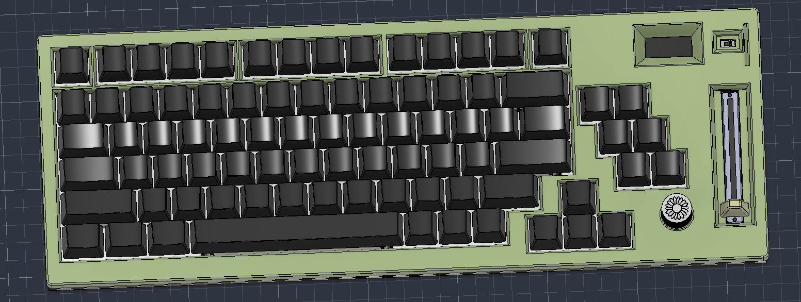
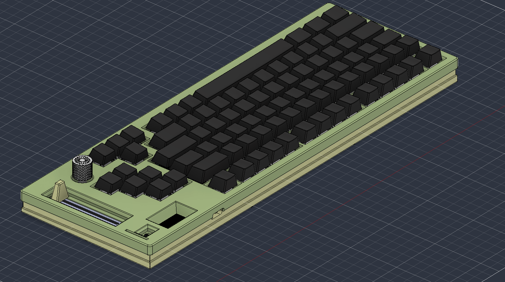

## Schematic
My schematics are so cooked that I need three images for this. The leds took so much space, but it only takes on gpio pin. I used the japanese duplex matrix, which is why there are two keys for each column in the schematic drawing for the switiches. The duplex matrix works with scanning with the different directions of diodes to be able to double the amount of keys on a keyboard, which is the main reason I was able to make a full keyboard with less pins.
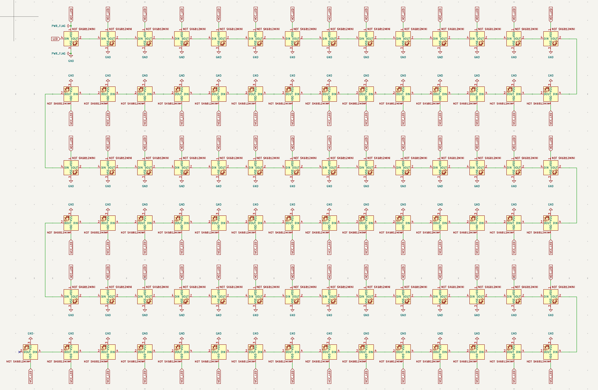
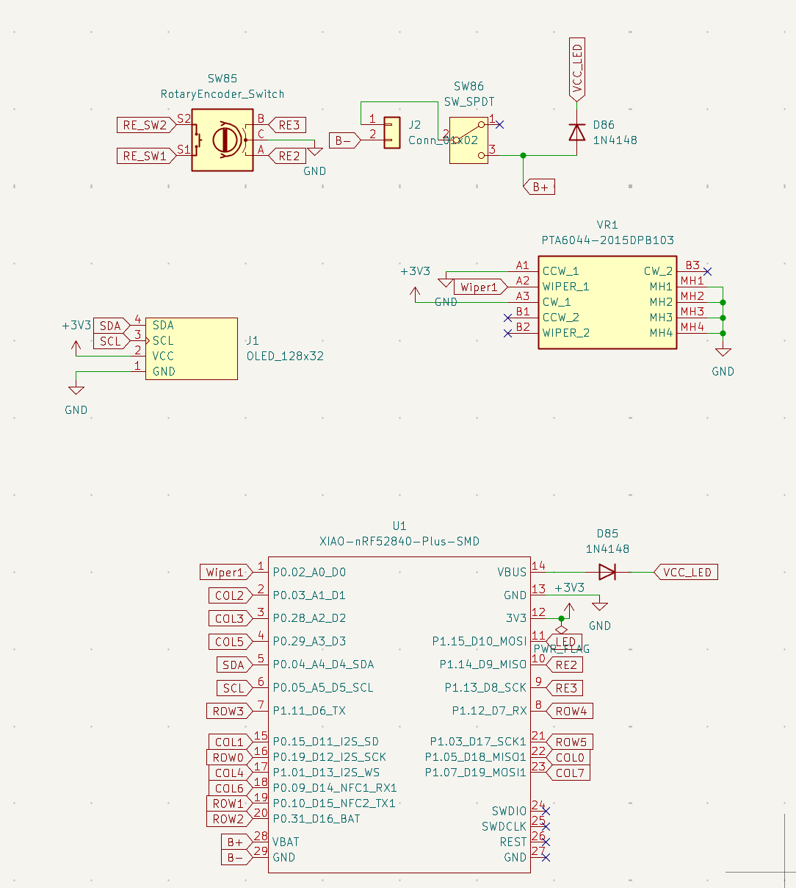
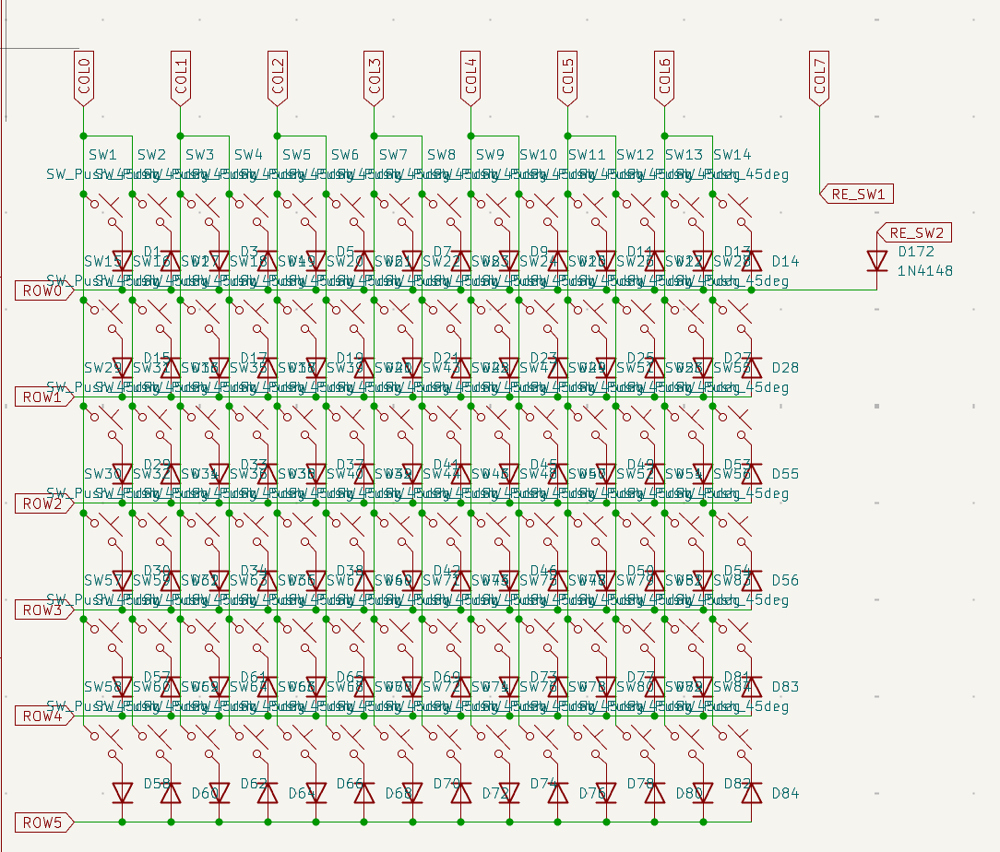

## PCB
The routing of this took so long, since I used a 7x7(2) matrix for it, I had to move all the switiches to make sure they all connected the same way. The routing of the leds were even worse.
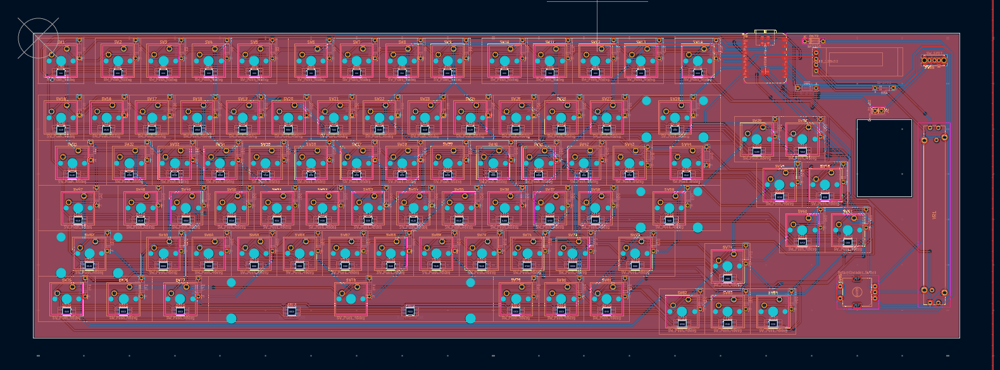
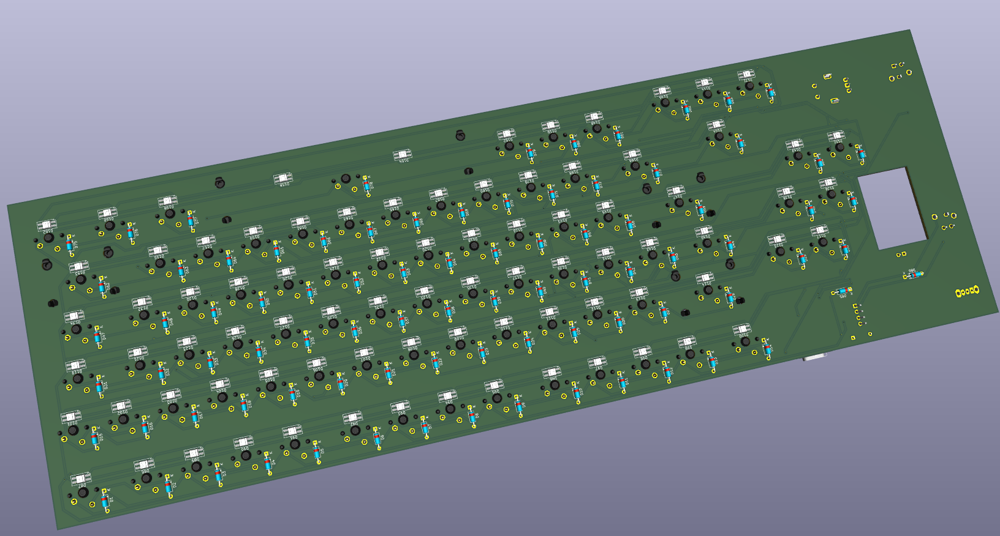
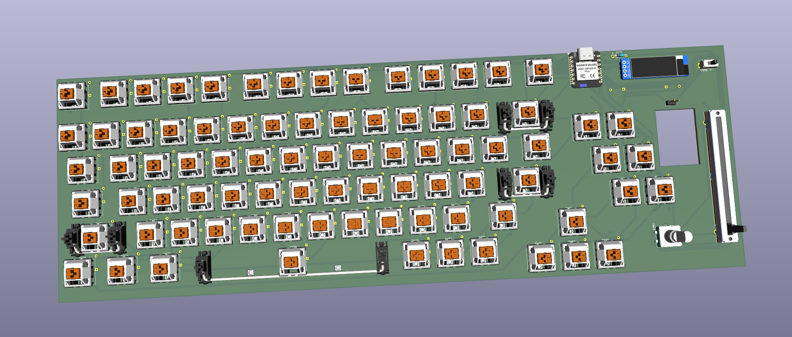

## Firmware
Still in progress, am trying to find a way for it to work with ZMK firmware, since some of my features are not supported with ZMK, but I really want to use the energy saving ways of bluetooth of ZMK. UPDATE: firmware: https://github.com/Soccer-1-0/zmk-config

## Casing
The casing took a very annoying long time. The plate itself took a long time since I used a keyboard layout generator, but then moved the keys during the routing process for a smaller pcb. I also had to add a bunch of holes for heat inserts, and screws, and the heads of the screws since I used a bottom mount for my keyboard (search it up, its a keyboard type of conencting between the plates and casing). But overall, I like how the casing ended up, I kinda wanted to add another part of casing to protect the keys and knobs, but we'll see if I actuall add it later.
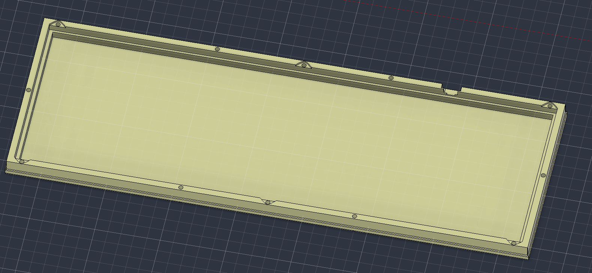
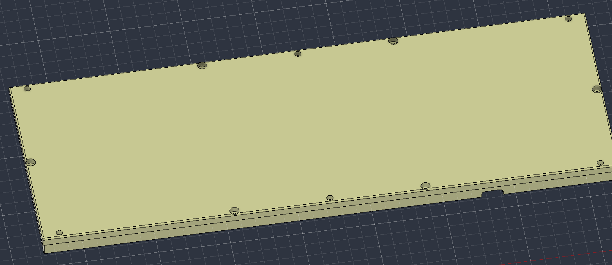
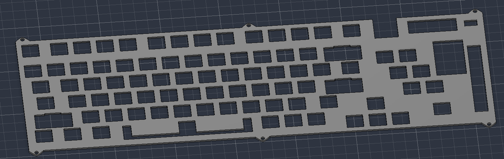
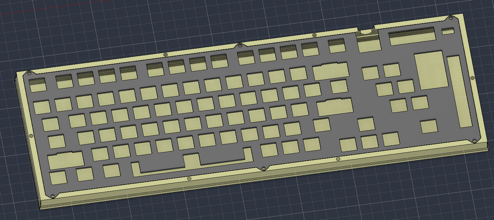
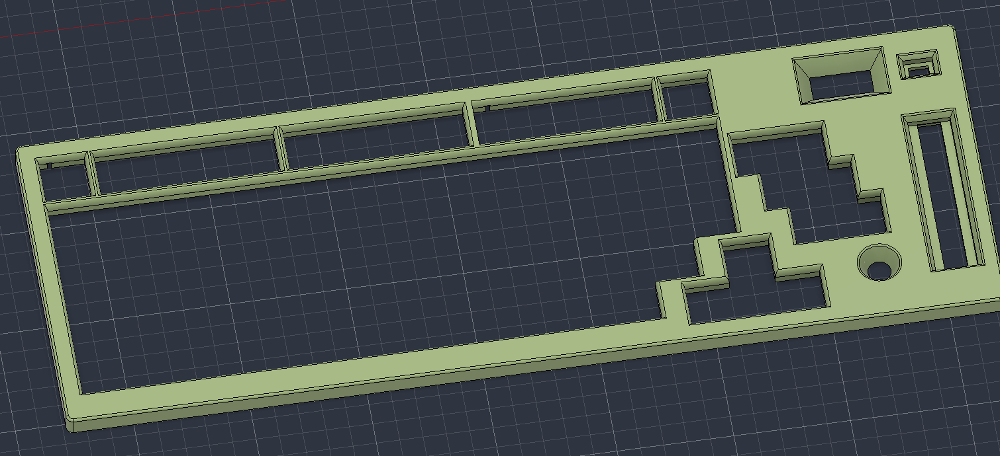
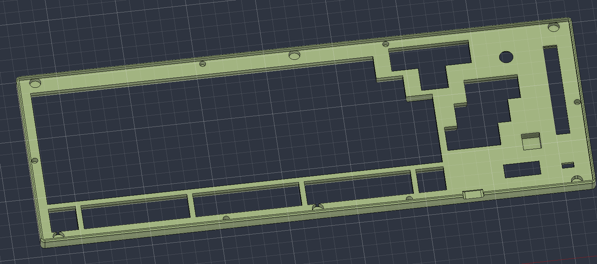
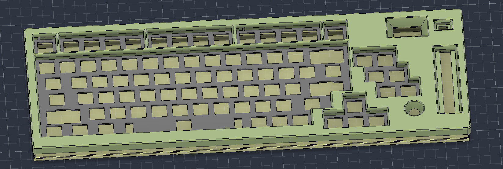

## BOM
- PCB
- Casing
- Keycaps
- 1N4148 Diodes
- 0.91 OLED Display
- 6.0U and 2.0 stabilizers
- Key Switches
- Rotary Encoder
- Slide Potentiometer
- Xiao NRF52840
- SK6812 Mini E LEDs
- SPDT Switch
- Rotary and Slider Knobs
- Litho Battery
- M3x18 Screws
